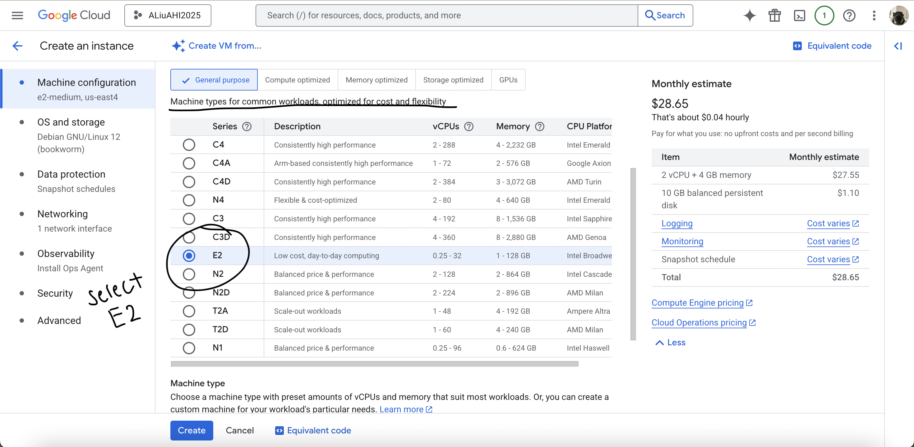

# VM Lifecycle on GCP and OCI — Tutorial

## Video Tutorials
Loom/Zoom: <paste link>

## Prerequisites
- Cloud access to GCP and OCI
- No PHI/PII; smallest/free-tier shapes

---

## Google Cloud (GCP)
### Creating Virtual Machine
1. Go to the [google cloud](https://console.cloud.google.com) site and log in
2. After confirming your project, click the button "Create a VM"

3. Type in a name for the VM in the fieldbox
4. Choose a region and a zone
5. Scroll down to "Machine types for common workloads..." and click E2, which is the smallest/free tier shapes

6. Scroll down more and click e2-micro

7. Click "OS and storage" on the left hand menu
8. Click on "change"

9. A boot disk page should pop up. Click on the drop menu for "operating system" and select "Ubuntu" 

10. No changes will be made to the other options.

### Start
11. Finally, click create. If your VM is running you will see a green circle with a check.

- Start: <state shows RUNNING>

### Stop
- Stop: <state shows TERMINATED/STOPPED>

12. Click on the 3 dots menu
13. Select "stop", a confirmation page will pop up. Select "stop" again. 
14. The VM will take a second to stop. Once it stops you will see a gray circle with a white square (where you saw the green circle before). Your VM has stopped running.
- In order to start this process again, select the 3 dotted menu and select the "start/select" button. You will then need to repeat the steps from 11. 

### Delete
15. Select the 3 dotted menu once again and click on "delete"

16. Once deleted, the VM should no longer be on the page anymore.

---

## Oracle Cloud (OCI)
### Create
1. Compartment: <name>
2. Networking: VCN with Internet Connectivity (defaults)
3. Shape: <smallest/free-eligible>
4. Image: Ubuntu (or Oracle Linux)
5. Public IP: ephemeral
6. Boot volume: default minimal

### Start/Stop
- Start: <state shows RUNNING>
- Stop: <state shows STOPPED>

### Terminate
- Terminate and delete boot volume; verify cleanup

---

## Reflections
### Similarities
- <brief bullets>

### Differences
- <brief bullets>

### Preference (OCI vs GCP) and Why
- <one short paragraph>
