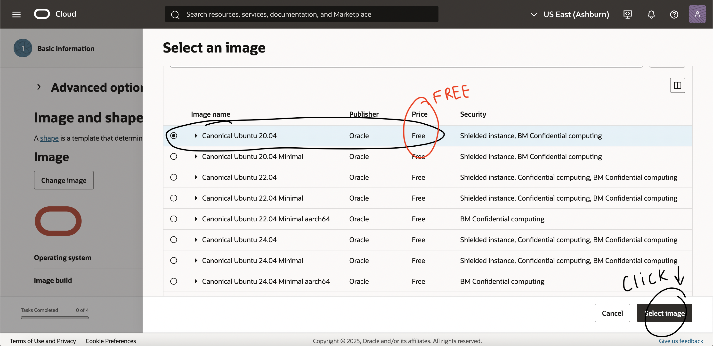
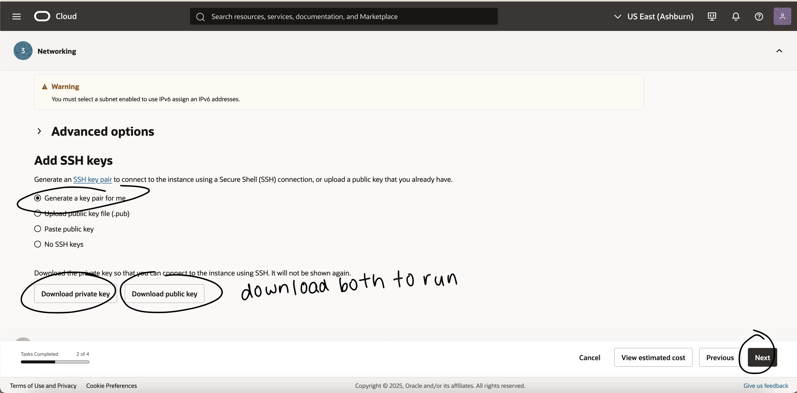

# VM Lifecycle on GCP and OCI — Tutorial

## Video Tutorials
[GCP](https://drive.google.com/drive/u/4/folders/1mBVUwnlDpNiAHFJyieAPfVtfc8_EHjxE)
[OCI](https://drive.google.com/drive/u/4/folders/1mBVUwnlDpNiAHFJyieAPfVtfc8_EHjxE)

## Prerequisites
- Cloud access to GCP and OCI
- No PHI/PII; smallest/free-tier shapes

---

## Google Cloud (GCP)
### Creating Virtual Machine
1. Go to the [google cloud](https://console.cloud.google.com) site and log in
2. After confirming your project, click the button "Create a VM"

3. Type in a name for the VM in the fieldbox
4. Choose a region and a zone
5. Scroll down to "Machine types for common workloads..." and click E2, which is the smallest/free tier shapes

6. Scroll down more and click e2-micro

7. Click "OS and storage" on the left hand menu
8. Click on "change"

9. A boot disk page should pop up. Click on the drop menu for "operating system" and select "Ubuntu" 

10. No changes will be made to the other options.

### Start
11. Finally, click create. If your VM is running you will see a green circle with a check.

- Start: <state shows RUNNING>

### Stop
- Stop: <state shows TERMINATED/STOPPED>

12. Click on the 3 dots menu
13. Select "stop", a confirmation page will pop up. Select "stop" again. 
14. The VM will take a second to stop. Once it stops you will see a gray circle with a white square (where you saw the green circle before). Your VM has stopped running.
- In order to start this process again, select the 3 dotted menu and select the "start/select" button. You will then need to repeat the steps from 11. 

### Delete
15. Select the 3 dotted menu once again and click on "delete" and then "delete" again

16. Once deleted, the VM should no longer be on the page anymore.

---

## Oracle Cloud (OCI)
### Create
1. Go to the [Oracle Cloud](https://www.oracle.com/cloud/) site and log in
2. Click "create a VM instance" which will be under the "build" section

3. Name the VM

4. Scroll down a select a domain, I left it at the default one. 
5. Scroll down and select "change image" and then choose either "Ubuntu" or "Oracle Linux"
- I selected "Ubuntu"

6. Click "select image"
7. Choose the smallest/free eligible. I chose the first free option.

8. Scroll down and select "change shape". Select the always free-eligible option and click "select shape".

9. Click next. At this point you can see your estimated cost.

10. Click "next" past security.
11. At the networking section, name your VNIC and create a new virtual cloud network. Scroll down until you see "add SSH keys" click both "download private key" and "download public key". Click "next"

12. No other changes. Review the information and click "create".

### Start

13. You will now see the work requests page. Once you see the screen "succeeded" status, the VM is ready.
14. Click "start" to run it. It should show "running" next to the name of the VM.

- Start: <state shows RUNNING>

### Stop

15. Click on the drop down menu "actions" and then click "stop" and then "stop instance". It will now show the status as red and say "stopped"

- Stop: <state shows STOPPED>

### Terminate
16. Click on the drop down menu "actions" click on "terminate" finally click "terminate instance". The status should now be gray and say "terminated".

---

## Reflections
### Similarities
- Both platforms provide a free trial without requiring billing details.
- Each offers a clean and easy to navigate homepage layout.
- Both sites include a clear explanation for different sections, and describes features/set up steps.
- Users can configure domains, operating systems, networking, and security options in both.
- Each platform provides core VM management functions.

### Differences
- OCI requires SSO authentication each session and also does log you out when idle, whereas GCP keeps you signed in through your google account. 
- GCP uses side tabs for quick navigation, whereas OCI requires more scrolling through each step in sequence.
- GCP loads a lot faster overall, while OCi took longer to respond during the set up process.
- The pricing did vary between the two sites.

### Preference (OCI vs GCP) and Why
- I would personally choose Google Cloud over OCI because it feels more intuitive and beginner friendly. The sidebar navigation and faster VM setup were also a plus. It was nice to beable to quickly start, stop, and delete the virtual machines compared to OCI which took a little more time. However, OCI does have better security whereas GCP keeps users logged in. 